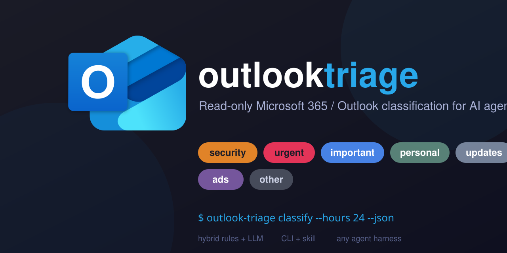

# outlook-triage




Read your Microsoft 365 / Outlook mail **read-only** and classify messages (important, ads, security, urgent, finance, travel, personal, updates, other) for AI agents. Ships as a Python CLI plus an opencode skill that teaches agents how to run it and finish the LLM part of classification.

## How classification works (hybrid)

1. **Deterministic rules (CLI):** Outlook's Focused Inbox (`inferenceClassification`), `importance`, user-applied categories, bulk headers (`List-Unsubscribe`, `Precedence: bulk` from `internetMessageHeaders`), security/urgency/finance/travel keywords, and your allow/block lists in `config.yml`.
2. **LLM pass (agent):** messages the rules can't resolve (`rule_indeterminate: true`) are classified by the agent using the rubric in `skill/RUBRIC.md`. No API key needed — the agent is the LLM.

Categories: `security`, `urgent`, `finance`, `travel`, `important`, `personal`, `updates`, `ads`, `other`.

## Setup

Two paths, same result — pick one.

### Option A: Setup with the outlook-triage-setup skill (recommended)

An agent does the work for you. Ask your agent to **"set up outlook-triage"** — it runs the `outlook-triage-setup` skill, which executes every shell step itself (install, OAuth device-code flow, verify) and guides you click-by-click through the only parts that need your Microsoft account and browser (the Microsoft Entra admin center). Requires an opencode skill runner; see [Skill (opencode)](#skill-opencode).

### Option B: Manual setup

Do the steps below yourself, then install the skills:

### 1. Microsoft Entra app registration (one time)

1. Go to https://entra.microsoft.com/ → **Identity** → **Applications** → **App registrations** → **New registration**.
2. Name it (e.g. `outlook-triage`), set **Supported account types** to **Accounts in any organizational directory (Multitenant) and personal Microsoft accounts** — required for both work/school and personal `outlook.com` mailboxes. Leave **Redirect URI** empty. Register.
3. Copy the **Application (client) ID** and save it in this project dir as `credentials.json`:
   `{"client_id": "<that-id>"}`
4. **Add the permission**: **Manage → API permissions → Add a permission → Microsoft Graph → Delegated permissions** → check **Mail.Read** (read-only!) → **Add permissions**.
5. **Allow public client flows** (required for the device-code flow): **Manage → Authentication →** **Advanced settings → Allow public client flows** → **Yes** → **Save**.

No client secret and no redirect URI are needed — this is a public client using OAuth 2.0 device-code flow.

### 2. Install

```bash
pip install -e .
```

### 3. Authenticate (one time, device-code flow)

```bash
outlook-triage auth-run
```

This prints a URL and a code; open the URL, sign in, approve the `Mail.Read` permission. The tool waits and saves the token.

Token is saved to `.outlook-triage/<account>/token.json` (`default` account unless `--account` is given). Both `credentials.json` and `.outlook-triage/` are your secrets — don't commit them.

### Multi-account

Each account gets its own token under `.outlook-triage/<name>/`. Auth and read:

```bash
outlook-triage auth-run --account work          # first time per account
outlook-triage classify --account work --hours 24
```

## Usage

```bash
# All fetch/classify/report commands support these flags:
outlook-triage inbox    --since 2026-01-01 --until 2026-02-01 --json   # full window
outlook-triage classify --hours 24 --json                              # last 24h (agent-facing)
outlook-triage report   --since 2026-07-01 --format md                 # markdown digest
outlook-triage config                                                   # merged config
```

- `--since`/`--until` — ISO dates (`YYYY-MM-DD`); map to OData `receivedDateTime ge/lt` (server-side filtering). `--until` is exclusive, so to include a day use the next day as `--until`.
- `--hours N` — shortcut; mutually exclusive with `--since`/`--until`.
- `--limit N` — caps results (default 100).
- `--full` — fetch full message bodies (default: `bodyPreview` snippet only).
- `--unread` — only unread messages (`isRead eq false`).
- `--folder <name>` — scope: `inbox` (default), `junkemail`/`spam`, `sentitems`/`sent`, `drafts`, `deleteditems`/`trash`, `archive`, `outbox`, `all`/`allitems` (entire mailbox), `focused`, `other`, or a custom folder display name.
- `--query "<terms>"` — extra **OData** `$filter` terms, e.g. `from/emailAddress/address eq 'payments@microsoft.com'`. Not Gmail syntax.
- `--account <name>` — which account to use (multi-account).
- `--format {text|md}` — report output format.
- `--no-collapse` — report flat message list instead of collapsing conversations.

Every message's JSON features include: `is_unread`, `importance`, `inference_classification`, `has_attachment`, `attachments` (name/type/size), and `unsubscribe_url` (parsed from `List-Unsubscribe`).

### For an AI agent

Use `outlook-triage classify --json` and consume the JSON. Messages with `rule_indeterminate: true` are the ones the agent must classify itself using `skill/RUBRIC.md`. The `outlook-triage` opencode skill automates this whole loop — ask your agent to "triage my inbox" and it will run it.

### Harness-agnostic

The CLI is a plain command that reads Microsoft Graph and emits JSON — it is **not** tied to opencode and works with any harness agent that can run a shell command (Claude Code, Codex, Cursor, custom scripts, cron, …). Only the skill wrapper is opencode-specific; it's just instructions, so port it to another harness by copying the process steps into that harness's agent prompt (e.g. `.claude/CLAUDE.md`).

## Configuration

Edit `config.yml` to tune rules:

- `rules.security_keywords` / `rules.urgent_keywords` / `rules.finance_keywords` / `rules.travel_keywords` — keyword lists.
- `rules.allow_senders` — map `email -> category` (e.g. `boss@work.com: important`).
- `rules.block_senders` — map `email` (or subject pattern) `-> category` (e.g. `deals@shop.com: ads`).
- `rules.allow_domains` / `rules.block_domains` — whole-domain rules.

Precedence: `block_senders` → `allow_senders` → `block_domains` → `allow_domains` → security keywords → ads (Focused Inbox / categories) → finance → travel → urgent keywords → importance:high → bulk/updates.

## Safety

- OAuth scope is **read-only** (`Mail.Read`). The tool cannot send, modify, or delete anything.
- The skill carries a hard read-only guardrail.

## Skill (opencode)

Two skills, sourced from this repo's `skill/`:

- **outlook-triage** (source: `skill/SKILL.md` + `skill/RUBRIC.md`) — triages the mailbox.
- **outlook-triage-setup** (source: `skill/setup/SKILL.md`) — guided install, OAuth, multi-account, troubleshooting.

Installed at `~/.config/opencode/skills/outlook-triage/` and `~/.config/opencode/skills/outlook-triage-setup/`. To reinstall after edits:

```bash
cp skill/SKILL.md skill/RUBRIC.md ~/.config/opencode/skills/outlook-triage/
cp skill/setup/SKILL.md ~/.config/opencode/skills/outlook-triage-setup/
```

## License

[MIT](LICENSE)
